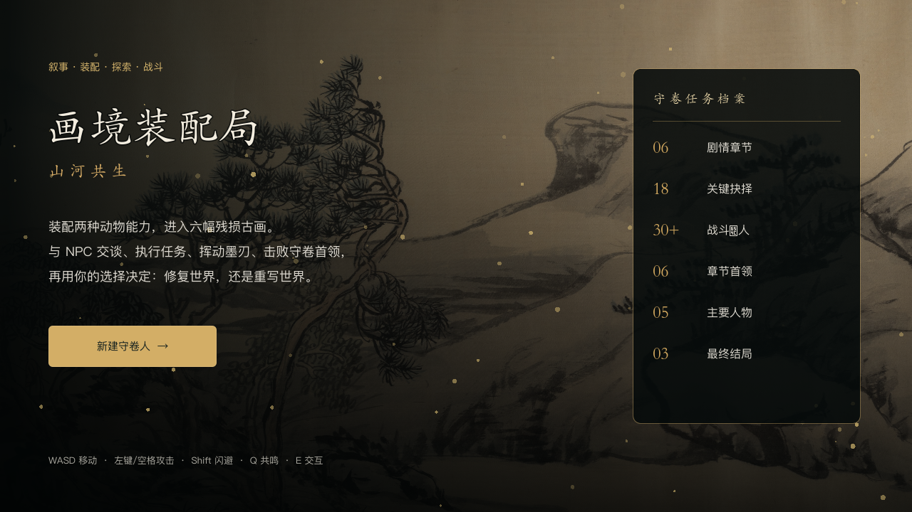
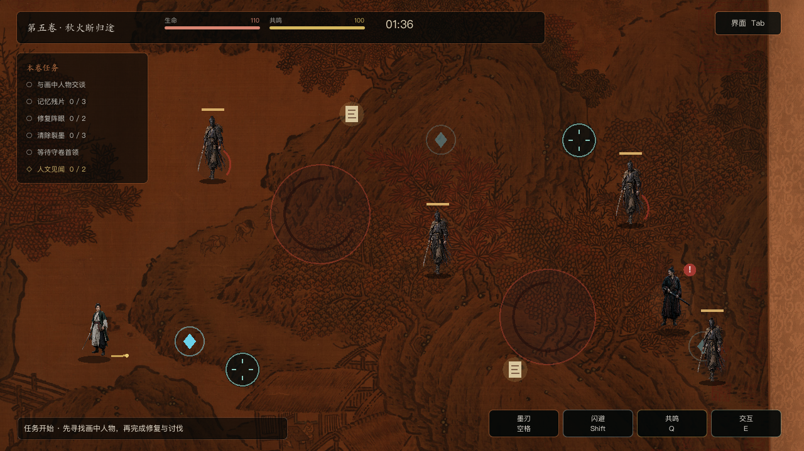
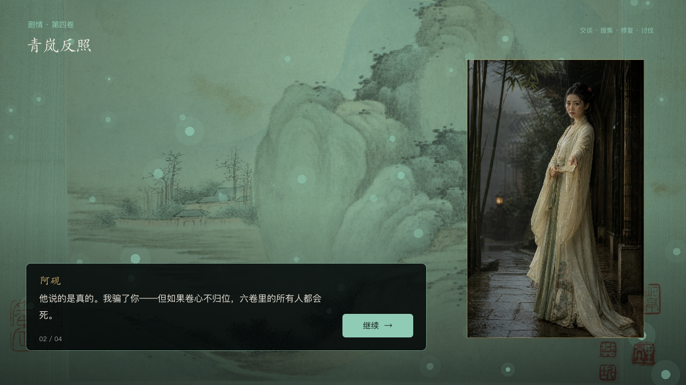
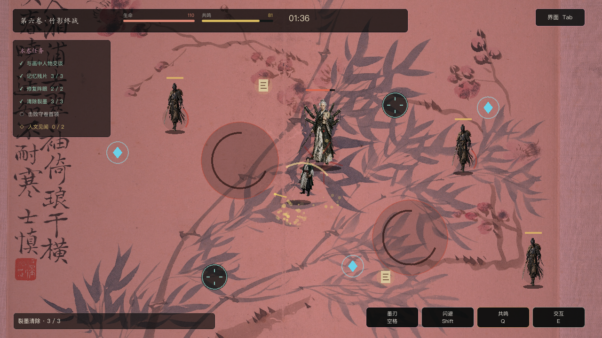

# 《画境装配局：山河共生》

把《万物装配局》的能力构筑与《画境山河》的多章节古画叙事融合成一款人文探索战斗冒险。









## 直接游玩

macOS 双击 `开始游戏.command`。也可以用 Godot 4.7 打开 `project.godot` 后运行。

## 一卷的完整循环

1. 在装配局选择两种动物共生能力。
2. 观看章节剧情，认识阿砚、沈烬、乔生与墨魇。
3. 进入古画地图，与 NPC 交谈并领取任务。
4. 探索三枚记忆残片、两处阵眼和两条可选人文见闻。
5. 使用墨刃战斗，清除裂墨并击败章节首领。
6. 战斗结束后处理这一卷的人与历史；选择会改变墨韵、心火、命数、英雄气和民声。

## 操作

- `WASD` / 方向键：移动
- 鼠标左键 / `空格` / `J`：墨刃攻击
- 鼠标右键 / `Shift` / `K`：闪避
- `Q`：画灵共鸣，范围伤害并显形目标
- `E`：和 NPC 交谈、调查见闻、修复阵眼
- `Tab`：隐藏 / 显示 HUD，让古画场景完整露出

画面右下角也提供了可点击操作按钮。

## 电影式视觉与动作

- 探索 HUD 改为窄顶栏与轻量任务条；剧情、NPC、见闻和选择不再使用满屏大面板。
- 长段中文使用段落排版组件，按中文标点自然换行。
- 守卷人使用透明全身角色美术，并拥有走步起伏、蓄势、突进、挥砍、闪避残影与受击反馈。
- 阿砚、沈烬、乔生、墨魇与守卷人具有一致的剧情立绘与场景人物形象，不再使用几何占位。
- 普通裂墨与六章首领均为独立精绘形象；碑甲墨兽、钟魇、纸傀、青兽、司书和初代守卷人各有明确的材料与文化母题。
- 视觉方向采用原创的古典武侠电影意境：空镜、竹影、雨雾、戏曲式停顿与克制色彩。

## 内容规模

- 六个剧情章节与六个首领
- 五名主要角色，24段章节对话
- 六种能力，形成15种双能力组合
- 18个关键抉择
- 12条普通人的人文见闻
- 三类结局
- 自动存档与失败后重组能力

## 叙事原则

本作沿用 OpenClaw 人文历史项目的基调：英雄气为主调，人民重量为底色，不喊口号。

“英雄气”不由击杀数增长，而来自明知代价仍选择不逃、对有能力伤害的人选择不伤害、以及把退路交给值得信任的人。“民声”则来自驿卒、车夫、桥匠、守林人、花农等普通人的可选见闻。

详细的来源转化说明见 `DESIGN_SOURCES.md`，古画署名见 `CREDITS.md`。

## 自动测试

```bash
/Applications/Godot.app/Contents/MacOS/Godot --headless --path . --script res://tests/smoke_test.gd
```

通过时输出：

```text
SMOKE_TEST_PASS chapters=6 combat=ok bosses=6 lore=12 choices=18 endings=3
```
